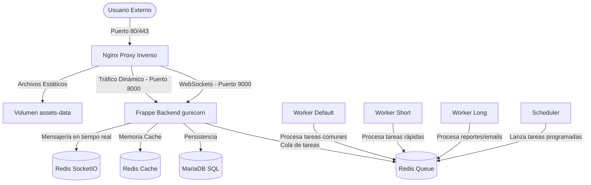

# Reporte Completo de Arquitectura e Implementación: ERPNext en la Nube (GCP VM)

Este documento detalla el paso a paso del proceso de diseño, contenerización y despliegue del stack de **Frappe Framework**, **ERPNext v15** y la custom app **Laboratorio** en una máquina virtual de **Google Cloud Platform (GCP)**.

---

## 1. Planificación de la Arquitectura
Frappe es un framework monolítico en su base de datos pero distribuido en sus servicios. Para que funcione correctamente en producción, requiere una arquitectura multi-contenedor. Diseñamos la solución dividida en 9 servicios que cooperan en la misma red de Docker:

---

## 2. Desarrollo de la Solución (Contenerización)

### Paso A: Creación de la Imagen Docker Personalizada (Dockerfile)
Para Frappe en Docker, la mejor práctica de la industria es compilar una imagen que contenga tanto el framework como todas las aplicaciones personalizadas (Custom Apps). Esto permite que los assets se optimicen de forma conjunta.
*   **Multi-Stage Build**:
    1.  **Stage Builder**: Usa NodeJS y Python para descargar el Bench de Frappe, descargar ERPNext (versión 15) y clonar tu custom app **Laboratorio** (rama `main`) desde GitHub. Luego compila todos los estáticos juntos (`bench build`).
    2.  **Stage Runner**: Copia la compilación limpia del Stage anterior a una imagen final ligera con `frappe-bench` instalado globalmente, reduciendo el tamaño y garantizando portabilidad.

### Paso B: docker-compose.prod.yml (Orquestación)
Define los servicios del diagrama. Configuramos:
*   Políticas de reinicio automático (`restart: always`) para garantizar que si el servidor o la VM se apagan, Docker levante todo automáticamente.
*   Volúmenes de datos compartidos (`sites-data`, `assets-data`, `apps-data`) para que Nginx pueda servir las imágenes y CSS que genera el contenedor del backend.

---

## 3. Despliegue en la Nube (GCP VM)

### Paso C: Creación de la VM en GCP
*   Seleccionamos la máquina **`e2-medium` (2 vCPUs, 4 GB RAM)** porque Frappe consume recursos considerables (NodeJS, Gunicorn, MariaDB y Redis juntos). 4 GB garantizan estabilidad sin caídas por falta de memoria (Out of Memory).
*   Configuramos el sistema operativo en **Ubuntu 22.04 LTS** (estable para producción).
*   Habilitamos el Firewall a nivel de red para tráfico **HTTP (Puerto 80)** y **HTTPS (Puerto 443)**.

### Paso D: Automatización del Despliegue
Diseñamos un script de automatización (`deploy.sh`) que corre al conectarse por SSH a la VM para:
1.  Instalar Docker y Docker Compose en la VM.
2.  Clonar el repositorio de producción.
3.  Compilar la imagen de Docker y levantar el stack.

### Paso E: Creación del Sitio y Solución de Bugs en la Nube
1.  **Conexión de Base de Datos**: Inicializamos el sitio especificando el host de base de datos de la red de Docker (`--db-host db`) y otorgando permisos de inicio de sesión de host comodín (`--mariadb-user-host-login-scope='%'`).
2.  **Enlace Nginx-Assets (El bug de CSS)**: Corregimos un fallo clásico de Frappe en Docker. Nginx no podía leer las hojas de estilo porque la carpeta de assets utiliza enlaces simbólicos apuntando al código de las aplicaciones. Compartimos el volumen `/apps` completo con Nginx para solucionar las rutas y renderizar el ERP a la perfección.
3.  **Dominio sslip.io**: Para evitar que tuvieras que configurar tu archivo `hosts` en cada PC, renombramos el sitio a `35.239.91.152.sslip.io`. Este servicio de DNS gratuito traduce cualquier petición de forma dinámica hacia tu IP pública, permitiendo compartir el enlace a cualquier persona en internet.
